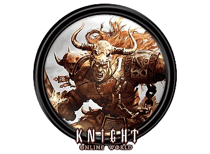
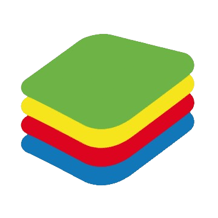

<div align="center">

# Klad Macro Tool

### Ekran Görüntüsü Okuyarak Tetiklenen Gelişmiş Makro Aracı

[](https://kladenets-codes.github.io/Klad-Macro-Tool/)
[](https://python.org)
[](LICENSE)

**[Dokümantasyon ve Demo Sayfası](https://kladenets-codes.github.io/Klad-Macro-Tool/)**

<a href="https://kladenets-codes.github.io/Klad-Macro-Tool/"></a> &nbsp;
<a href="https://kladenets-codes.github.io/Klad-Macro-Tool/"></a> &nbsp;
<a href="https://kladenets-codes.github.io/Klad-Macro-Tool/"></a>

</div>

---

## Nedir?

Klad Macro Tool, oyunlarda skill ikonları, buff/debuff göstergeleri veya herhangi bir görsel değişiklik algılandığında otomatik tuş/makro çalıştıran bir araçtır. OpenCV tabanlı template matching ile **60+ FPS** hızında ekran taraması yapar.

> Proje özellikle WoW'daki GSE (Gnome Sequencer Enhanced) kullanımı için geliştirilmiştir.

## Kullanım Alanları

| Oyun | Özellikler |
|------|------------|
| **World of Warcraft** | WeakAuras + GSE entegrasyonu, proc-based rotation, cooldown tracking, buff/debuff izleme, oto-interrupt |
| **Knight Online** | Assassin combo, Minor combo, HP/MP potion otomasyonu, Warrior rotation |
| **Emulator / Diğer** | Mobile game farming, auto-clicker, test otomasyonu |

## Özellikler

- **Grup Sistemi** - Bağımsız toggle key, arama bölgesi ve template'ler
- **Template Matching** - OpenCV tabanlı, ayarlanabilir threshold
- **Gelişmiş Makro** - Logitech G Hub tarzı `key_down`, `key_up`, `sleep` komutları
- **Kayıt Modu** - Klavye girişlerini direkt makroya kaydet
- **Yüksek Performans** - mss + grayscale optimizasyonu, 60+ FPS
- **FPS Overlay** - Gerçek zamanlı arama hızı göstergesi
- **Drag & Drop** - Template ve makro sıralamasını sürükle-bırak ile değiştir
- **Modern Arayüz** - Karanlık tema, sezgisel kullanım

## Kurulum

```bash
# Gereksinimleri yükle
pip install -r requirements.txt

# Uygulamayı çalıştır
python klad_macro_tool.py
```

> Windows'ta yönetici hakları gerektirir (keyboard hooks için)

## Kullanım

1. **Grup oluştur** - Toggle key belirle
2. **Arama bölgesi seç** - Küçük bölge = yüksek FPS
3. **Template ekle** - Ekrandan görsel yakala
4. **Tuş/Makro ayarla** - Eşleşince ne yapılacağını belirle
5. **Başlat** - Toggle key ile aktifleştir

## Gereksinimler

- Python 3.8+
- opencv-python
- numpy
- mss
- keyboard
- Pillow
- customtkinter

## Lisans

MIT
